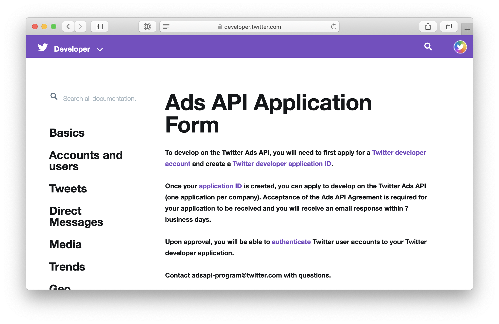

[back to README.md](../README.md/#setup)

# Fill out the Ads API Application Form



Fill out the form at https://developer.twitter.com/en/docs/ads/general/overview/adsapi-application.

If you do not receive a response within 7 business days, contact `adsapi-program@twitter.com` with the ID of your app.

Here are some anwsers to the option that I usually default to

### `#Business`

#### Of the following, which best describes your business?\*

- ( ) Advertiser
- ( ) Agency
- ( ) Data provider
- (x) Technology platform

#### How will you use the Ads API?\*

- [ ] Campaign management (Creating/editing Campaigns and/or line items, bid/budget adjustments, objective and targeting)
- [x] Creatives (uploading images, videos, and/or creating cards and tweets)
- [ ] Tailored Audiences (uploading 1st or 3rd party data)
- [ ] Analytics (Pulling metrics and other data for reporting)

#### In 280 characters or less...

...tell us about your business\*

> Independent Open Source project

...what do you plan to build on the Ads API?\*

> Create pools

...describe your unique differentiators in the Ad Tech ecosystem\*

> We are utilizing https://github.com/gr2m/twitter-together to collaborate on tweets with our community

#### Do you have API partnerships on any other platforms?

- [ ] Amazon
- [ ] Facebook
- [ ] Instagram
- [ ] LinkedIn
- [ ] Pinterest
- [ ] Snapchat
- [ ] Other

### `#Clients`

#### Where are your customers based? Please indicate your top market\*

United States

#### Which industries are most common among your customers?\*

- Media & Entertainment
- Education
- Tech B2C

#### Tell us more about your strategic customers/advertisers\*

> The app is for self-use only. THere are not strategic customers/advertisers.

### `#Product`

#### Of the following campaign objectives, where is your offering strongest?\*

- not applicable

#### How is your product distributed?\*

- [ ] SaaS
- [ ] Managed service
- [ ] Channel partnerships
- [ ] OEM/White label
- [x] Internal business system

#### List the languages that your product supports\*

> Any language

#### Does your product currently use or plan to ultilize any other Twitter APIs?\*

- ( ) Yes
- (x) No

#### Do you license data from Twitter's Data APIs?\*

- ( ) Yes
- (x) No

# After your twitter app was approved

You need to get your account id. Open [ads.twitter.com](https://ads.twitter.com), press on "Go to Twitter Ads", then the part the 2nd segment of the URL path. For example if the new URL is

```
https://ads.twitter.com/onboarding/18ce551qf6o/welcome?onboarding=true
```

your twitter account id is `18ce551qf6o`. Now set `TWITTER_API_SECRET_KEY` in your `twitter-together.yml` file.

```yml
on: [push, pull_request]
name: Twitter, together!
jobs:
  preview:
    name: Preview
    runs-on: ubuntu-latest
    if: github.event_name == 'pull_request'
    steps:
      - uses: gr2m/twitter-together@v1.x
        env:
          GITHUB_TOKEN: ${{ secrets.GITHUB_TOKEN }}
  tweet:
    name: Tweet
    runs-on: ubuntu-latest
    if: github.event_name == 'push' && github.ref == 'refs/heads/master'
    steps:
      - name: checkout master
        uses: actions/checkout@v2
      - name: Tweet
        uses: gr2m/twitter-together@v1.x
        env:
          GITHUB_TOKEN: ${{ secrets.GITHUB_TOKEN }}
          TWITTER_ACCESS_TOKEN: ${{ secrets.TWITTER_ACCESS_TOKEN }}
          TWITTER_ACCESS_TOKEN_SECRET: ${{ secrets.TWITTER_ACCESS_TOKEN_SECRET }}
          TWITTER_API_KEY: ${{ secrets.TWITTER_API_KEY }}
          TWITTER_API_SECRET_KEY: ${{ secrets.TWITTER_API_SECRET_KEY }}
          TWITTER_ACCOUNT_ID: 18ce551qf6o
```

---

[back to README.md](../README.md/#setup)
